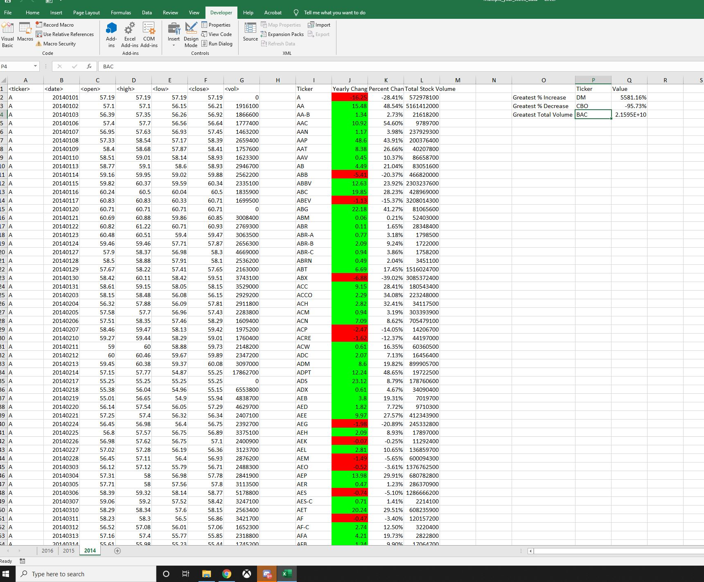

# VBA Homework with the Challange Completion

## Attached are the requested screen shots for each year in the following order. 204, 2015, 2016 and the code I used to find it

* [VBS Code](https://github.com/alexcorona-25/UCI-Homework-Corona/blob/master/02_VBA-Challenge/VBA%20HomeWork.vbs)

## 2014 VBA ScreenShot
#### After looking at the Data we can find the following

* Greatest % Increase: DM with 5581.16%
* Greatest % Decrease: CBO with -95.73%
* Greatest Total Volume: BAC 2.1595 E +10

## 2015 VBA ScreenShot
#### After looking at the Data we can find the following

* Greatest % Increase: ARR with 491.30%
* Greatest % Decrease: KMI.W with 98.59%
* Greatest Total Volume: BAC 2.1595 E +10

## 2016 VBA Screenshot
#### After looking at the Data we can find the following

* Greatest % Increase: SD with 11575.00%
* Greatest % Decrease: KMI.W with -91.49%
* Greatest Total Volume: BAC 2.1595 E +10

